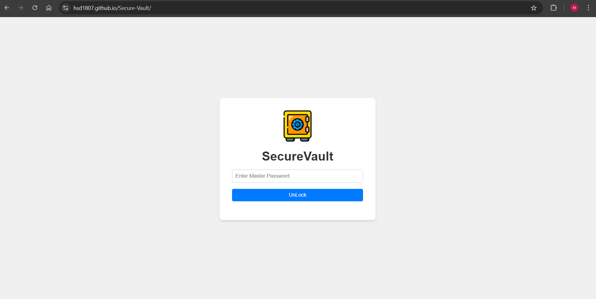
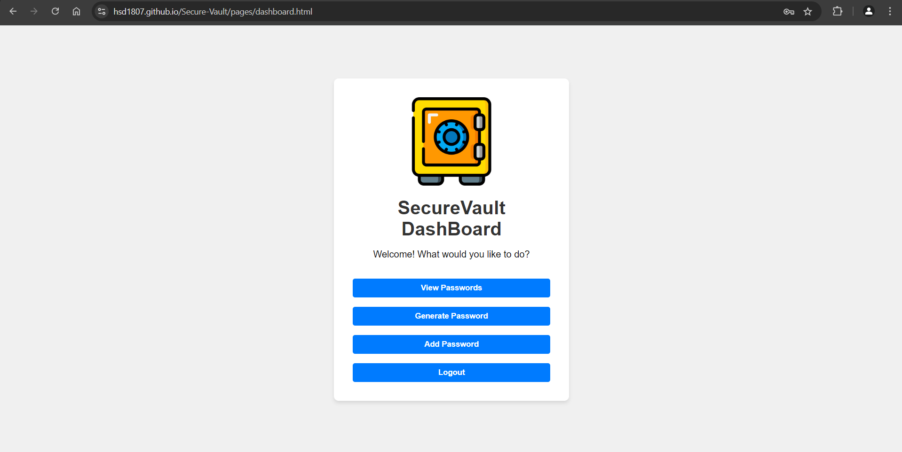
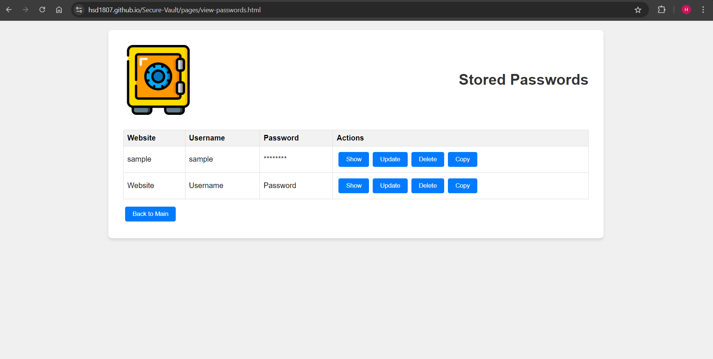
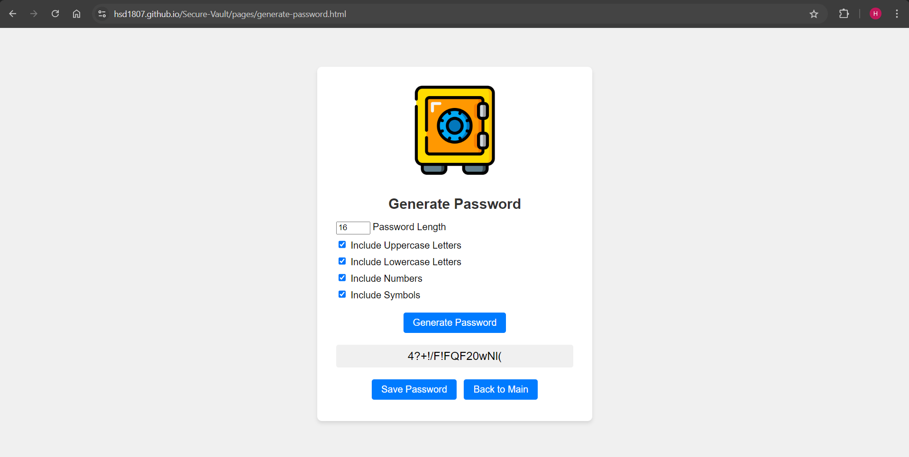
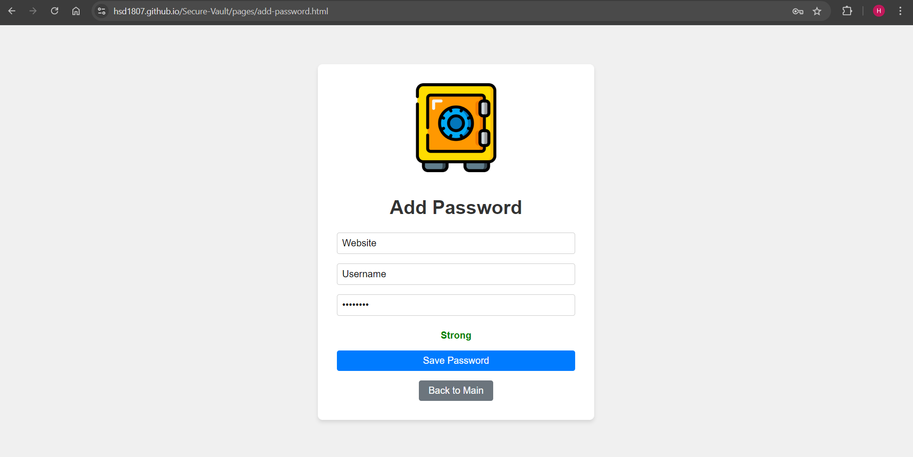

# SecureVault - A Vault for your PassWords


SecureVault is a secure password management web application developed as part of the Web Basics Project. It allows users to store, generate, and manage their passwords in a user-friendly interface.


## Project Overview

- **Project Name:** SecureVault
- **Tech Stack:** HTML, CSS, JavaScript
- **Data Storage:** Web Local Storage
- **Responsive Design**
- **CRUD(Create, Read, Update, Delete) Operations**

## Features

- Secure master password authentication
- View stored passwords
- Generate strong, random passwords
- Add, edit, and delete passwords (CRUD operations)
- User-friendly dashboard interface
- Logout functionality for enhanced security

## Screenshots

### UnLock the Vault


### Dashboard


### View Passwords


### Generate Password


### Add/Edit Password


## Installation and Usage

1. Clone the repository:
   ```
   git clone https://github.com/yourusername/securevault.git
   ```
2. Navigate to the project directory:
   ```
   cd securevault
   ```
3. Open `index.html` in your web browser to start using SecureVault.

## Security Note

SecureVault is designed with security in mind. However, as this is a frontend-only implementation for an educational project, it should not be used for storing real, sensitive passwords without proper backend security measures.
